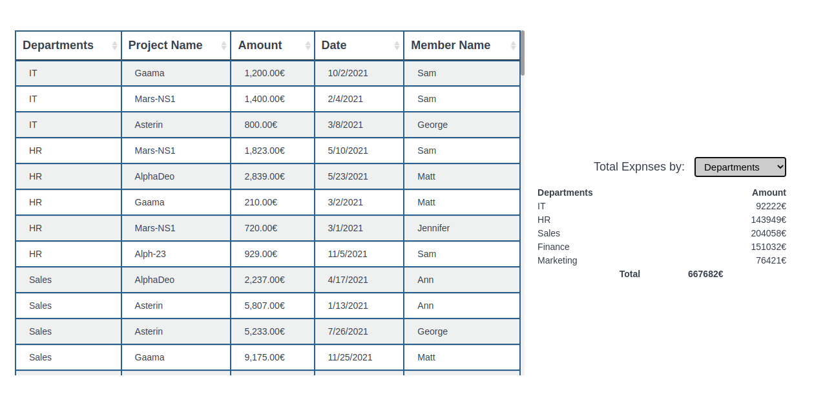

# What about it?

This is a project which gets data in the form of comma seperated (departments,project_name,amount,date,member_name) from an api call and shows in tabular form . By clicking in any field of table we can sort table . Also Filerting by fields (departments,project_name,date, member_name) and shows total amount of each filtered field.This is totally dynamic table (can create multiple fields as you like).

  

# Getting Started with Create React App

This project was bootstrapped with [Create React App](https://github.com/facebook/create-react-app).

## Available Scripts

In the project directory, you can run:

### `npm start`

Runs the app in the development mode.\
Open [http://localhost:3000](http://localhost:3000) to view it in the browser.

The page will reload if you make edits.\
You will also see any lint errors in the console.

##

## Learn More

You can learn more in the [Create React App documentation](https://facebook.github.io/create-react-app/docs/getting-started).

To learn React, check out the [React documentation](https://reactjs.org/).
